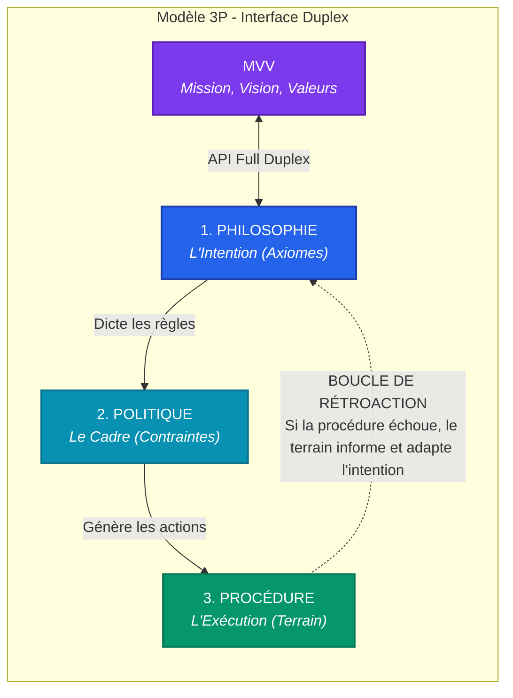
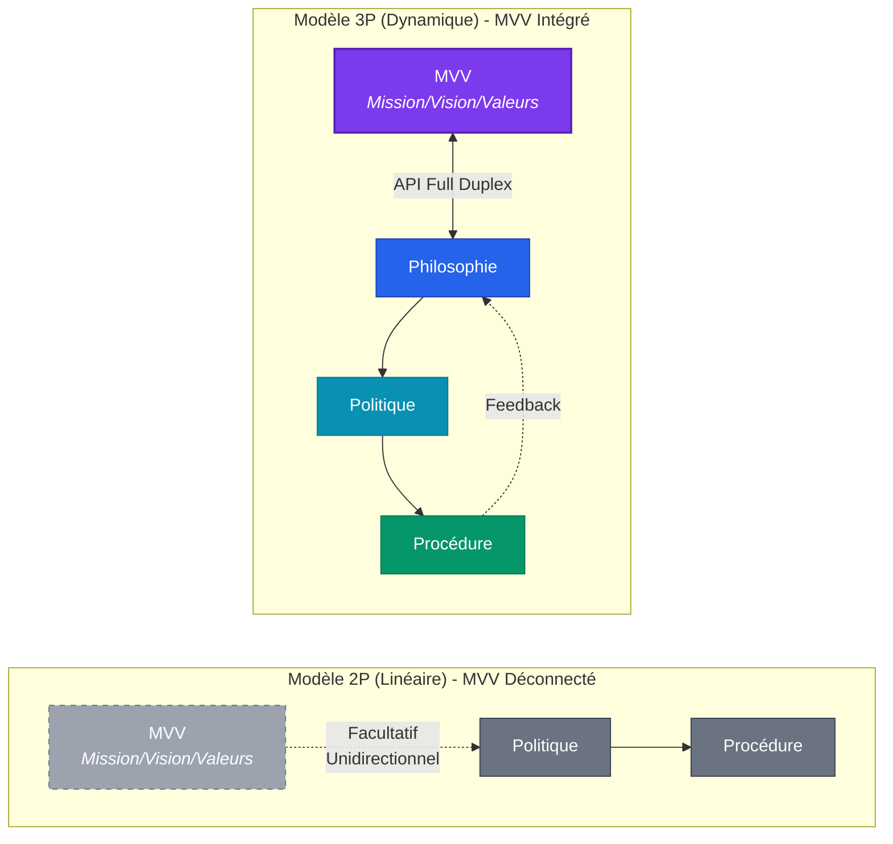

# Le Modèle 3P : Gouvernance Systémique et Synthèse Interdisciplinaire

**Auteur :** Vectura Industrial ([@funnyfisherman](https://github.com/funnyfisherman))  
**Licence :** MIT

---

## Table des matières

- [Introduction](#introduction)
- [1. Le Constat d'Échec : La Fragilité du Modèle "2P"](#1-le-constat-déchec--la-fragilité-du-modèle-2p)
  - [L'Illusion du MVV et l'Interface "Duplex"](#lillusion-du-mvv-et-linterface-duplex)
- [2. L'Architecture du Modèle 3P](#2-larchitecture-du-modèle-3p)
- [3. Topologie du Système (Diagramme)](#3-topologie-du-système-diagramme)
  - [Comparaison : Modèle 2P vs 3P](#comparaison--modèle-2p-vs-3p)
- [4. La Généalogie Interdisciplinaire (La Synthèse)](#4-la-généalogie-interdisciplinaire-la-synthèse)
- [5. Les Bénéfices Opérationnels](#5-les-bénéfices-opérationnels)
- [6. Usage & Implémentation](#6-usage--implémentation)
- [7. Conclusion : L'Échelle de la Gouvernance](#7-conclusion-léchelle-de-la-gouvernance)

---

## Introduction

L'ingénierie et la gestion industrielle modernes souffrent d'une fracture systémique : la séparation entre ceux qui pensent le système (l'Administration) et ceux qui l'exécutent (l'Ingénierie et les Opérations). Cette ségrégation crée des "boîtes noires" où les responsabilités se perdent et où l'innovation est paralysée par la bureaucratie.

Le Modèle 3P est un framework open-source de gouvernance agnostique. Conçu par Vectura Industrial, il offre une grille de lecture et d'exécution permettant de concevoir, déployer et maintenir des systèmes complexes (qu'ils soient logiciels, mécaniques ou organisationnels) sans friction de paradigme.

### Pourquoi ce modèle ? (Proposition de Valeur)

L'adoption du framework 3P ne remplace pas vos ingénieurs ; il optimise leur cadre de décision. Il garantit trois avantages compétitifs asymétriques :

1. **L'Élimination des Goulots d'Étranglement :** En décentralisant la compréhension du "Pourquoi" (La Philosophie), l'opérateur de terrain n'a plus besoin d'attendre la permission de la direction pour résoudre un problème imprévu. Il est autonome et enligné.
2. **Mitigation Radicale du Risque :** Fini les firmes externes qui se cachent derrière des clauses d'exclusion. Le modèle impose un alignement strict : la Procédure ne peut exister si elle viole la Politique, et la Politique est caduque si elle trahit la Philosophie.
3. **Le Pont "Business-to-Tech" :** Il offre enfin un langage commun entre le Conseil d'Administration (qui gère le capital) et le département des TI ou de l'usine (qui gère l'exécution).

---

## 1. Le Constat d'Échec : La Fragilité du Modèle "2P"

Historiquement, le management corporatif s'appuie sur le modèle P&P (Politiques & Procédures). C'est un modèle linéaire, binaire (de type Débit/Crédit), conçu pour l'obéissance de masse.

Le défaut fatal du modèle 2P est sa rigidité : si un événement imprévu survient sur le terrain, la procédure n'a pas de réponse. L'opérateur fige. Les déclarations de "Mission/Vision/Valeur" (MVV) générées par les ressources humaines vivent dans un silo isolé et n'offrent aucun secours technique à l'ingénieur ou au technicien face à un système défaillant.

Pour survivre à la complexité industrielle et technologique moderne, la gouvernance doit intégrer l'intention originelle au cœur de l'exécution.

### L'Illusion du MVV et l'Interface "Duplex"

Le modèle corporatif standard tente de pallier cette rigidité en ajoutant une couche "Mission, Vision, Valeurs" (MVV). L'échec de cette approche vient de son unilatéralité. Le MVV est décoratif : une valeur conceptuelle comme "l'excellence client" ne fournit aucune directive technique à un ingénieur confronté à une panne de routeur. Il s'agit d'un silo de relations publiques déconnecté des opérations physiques.

Le modèle 3P ne cherche pas à détruire le MVV, mais à agir comme son **API d'exécution**. Le pôle "Philosophie" du 3P est la traduction concrète et opérationnelle du MVV de l'entreprise.

Surtout, cette interface fonctionne en mode **duplex (bidirectionnel)** :

1. **Top-Down :** La Mission, Vision et Valeurs (MVV) de l'entreprise dictent les axiomes d'ingénierie de la Philosophie.
2. **Bottom-Up :** Si les contraintes physiques rencontrées lors de l'exécution (la Procédure) démontrent que le MVV est irréaliste ou dangereux, le signal remonte instantanément la chaîne. Ce flux "duplex" force le MVV à s'adapter à la réalité du terrain, l'empêchant de se transformer en propagande corporative vide de sens.

---

## 2. L'Architecture du Modèle 3P

Le Modèle 3P transforme la ligne droite du "P&P" en un triangle dynamique avec une boucle de rétroaction.

* **P1 - La Philosophie (L'Intention / Le Compilateur) :** Ce ne sont pas des valeurs décoratives, mais des axiomes d'ingénierie stricts (ex: *Souveraineté des données, Zéro Boîte Noire, Tolérance aux pannes*). C'est l'algorithme de résolution de problèmes quand la procédure échoue.
* **P2 - La Politique (Le Cadre / Le Déterminisme) :** Les limites physiques, légales et technologiques dictées par la Philosophie (ex: *Aucun outil de production critique ne doit dépendre d'un Cloud public*).
* **P3 - La Procédure (L'Action / L'Exécution) :** L'instruction étape par étape pour l'opérateur (ex: *Déploiement d'un cluster PostgreSQL bare-metal*).

---

## 3. Topologie du Système (Diagramme)

Le cœur du système réside dans sa boucle de rétroaction. L'exécution (Bottom) a le pouvoir d'informer et de modifier la Philosophie (Top) face à la réalité du terrain.

### Comparaison : Modèle 2P vs 3P

| Aspect | Modèle 2P (P&P) | Modèle 3P |
|--------|-----------------|-----------|
| **Structure** | Ligne droite | Triangle avec boucle |
| **Adaptabilité** | Faible - l'opérateur fige | Élevée - boucle de rétroaction |
| **Guidance** | Procédures uniquement | Philosophie → Politique → Procédure |
| **MVV** | Silo décoratif | Intégré via l'API duplex |
| **Autonomie** | Aucune - attente de permission | Élevée - décision basée sur axiomes |

---

## 4. La Généalogie Interdisciplinaire (La Synthèse)

Le modèle 3P ne cherche pas à réinventer la roue, mais à unifier des silos historiquement opposés. Il est la synthèse de trois grandes sciences de l'organisation :

- **Le monde Militaire (L'Adaptabilité) :** Emprunte le concept du Commander's Intent. L'opérateur connaît l'intention finale. Si le plan s'effondre au premier contact, il utilise la Philosophie pour improviser une nouvelle Procédure valide.

- **L'Ingénierie (La Rigueur Systémique) :** S'inspire de l'Axiomatic Design. Aucune action physique n'est posée sans qu'elle ne réponde à un prérequis fonctionnel mathématique ou logique absolu.

- **L'Administration des Affaires (Le Scalability) :** Fournit le cadre organisationnel (Top-to-Bottom) pour déployer cette rigueur à travers tous les départements (TI, Ventes, Logistique) de manière uniforme.

---

## 5. Les Bénéfices Opérationnels

- **L'Appropriation Cognitive (L'Effet IKEA) :** Les ingénieurs détestent les règles administratives, mais respectent la logique systémique. En codifiant la gestion comme une architecture d'ingénierie, l'adhésion des équipes techniques est organique.

- **Le Filtre de Qualification B2B :** Ce manifeste agit comme un Honeypot. Il attire les partenaires et les clients qui valorisent la transparence et la résilience, et repousse les firmes qui se cachent derrière l'opacité (Boîtes noires) et les clauses de non-responsabilité.

- **Résilience Asymétrique :** Les opérateurs ne sont plus de simples exécutants de procédures ; ils deviennent des auditeurs du système, capables de le réparer sans attendre l'ordre de la direction.

---

## 6. Usage & Implémentation

Ce dépôt GitHub n'est pas une librairie de code, c'est une architecture de pensée ("Framework-as-Code"). Voici comment l'utiliser :

1. **Pour votre organisation :** Forkez (copiez) ce dépôt dans votre propre environnement. Remplacez nos axiomes philosophiques par les vôtres. Utilisez nos grilles d'analyse pour évaluer vos futurs fournisseurs et vos architectures internes (Réseau, OT/ICS, Logiciel).

2. **Pour la communauté :** Ce modèle est vivant. Si vous avez appliqué cette méthodologie à un cas d'usage spécifique (ex: déploiement d'une infrastructure Zero-Trust, automatisation d'une chaîne de montage), soumettez une *Pull Request* pour ajouter votre étude de cas à notre documentation.

---

## 7. Conclusion : L'Échelle de la Gouvernance

L'excellence opérationnelle n'est pas une somme de procédures, c'est un écosystème cohérent. Le Modèle 3P s'insère dans une hiérarchie organisationnelle stricte à cinq niveaux :

1. **La Culture :** L'écosystème invisible (L'ADN de l'entreprise).
2. **La Gouvernance :** Les règles du jeu globales.
3. **Le Stratégique (La Philosophie - P1) :** L'intention absolue.
4. **Le Tactique (La Politique - P2) :** Le cadre de contraintes.
5. **L'Opérationnel (La Procédure - P3) :** L'exécution physique.

En forçant la fusion des niveaux 3, 4 et 5 dans un cycle d'apprentissage continu, Vectura Industrial propose de mettre fin au "bullshit corporatif" pour ramener la rigueur scientifique au cœur de la gestion d'entreprise.

---

## 8. État de l'Art et Démocratisation Systémique (Le "Pourquoi")

Un inventaire honnête des connaissances démontre que les éléments du Modèle 3P existent déjà, mais qu'ils sont isolés dans des silos disciplinaires étanches :

*   **En Informatique et Ingénierie :** Des cadres normatifs comme ITIL ou ISO 9001 structurent l'architecture des services, tandis que la Conception Axiomatique (*Axiomatic Design*) formalise mathématiquement la logique des systèmes.
*   **Dans le monde Militaire :** Le concept de l'Intention du Commandant (*Commander's Intent*) établit que la Philosophie de la mission doit guider l'opérateur lorsque la Procédure échoue sur le terrain.
*   **En Administration des Affaires :** L'enseignement académique classique sépare l'aspect relationnel ("Mission, Vision, Valeurs") de l'aspect opérationnel ("Politiques et Procédures"), créant un vide entre l'intention et l'exécution.

Le savoir existe, mais il n'avait jamais été formalisé sous la forme de ce triptyque simple, intégré et cyclique.

### La véritable raison de cette publication

Pourquoi publier ce modèle ? La raison est **la traduction et la distribution de masse**.

Les concepts de résilience systémique mentionnés plus haut sont redoutables, mais ils sont réservés à une élite d'ingénieurs certifiés ou de stratèges militaires. Ils sont accessibles, moyennant un effort, pour les milliers d'étudiants, de gestionnaires et d'entrepreneurs qui sortent des programmes d'administration classiques, mais ne sont malheureusement pas intégrés dans les modèles standards et dans les guides de plans d'affaires.

La philosophie derrière cette publication est de prendre des concepts complexes de haut niveau, d'en extraire l'essence, et de les injecter dans les notions de base compréhensibles et utilisables par n'importe qui. Nous publions le Modèle 3P pour que la rigueur de l'ingénierie et l'agilité tactique puissent enfin être enseignées, comprises et appliquées par la communauté administrative générale, en espérant qu'il fera un jour partie des modèles enseignés.

---

## Licence

Ce projet est sous licence MIT. Voir le fichier [LICENSE](LICENSE) pour plus de détails.

---
En ingénierie logicielle, un "commit" est une contribution qui vient corriger, améliorer ou mettre à jour le code source d'un projet commun. Considérez ce dépôt (repository) comme mon *commit* personnel à la science de la gestion et de l'administration. C'est ma façon de documenter et de partager une amélioration potentielle dans le grand corpus d'une communauté encore plus vaste. J'espère que cette contribution aidera d'autres bâtisseurs à solidifier leurs propres systèmes. -note de l'auteur

---

*"La procédure échoue, la philosophie persiste."* — Vectura Industrial
